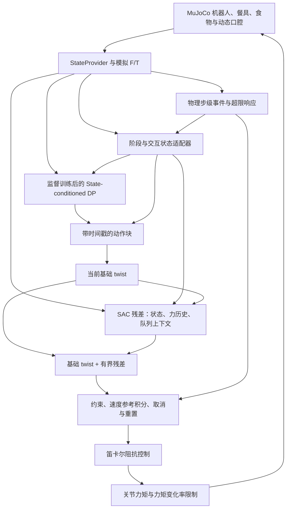

# SimModelPlan：从零实现复杂喂餐的完整仿真控制项目

编写与开源核查日期：2026-09-24  
项目阶段：只有 Ubuntu 电脑和 feedingrobot conda 环境；没有实体机械臂、示范数据或已实现控制程序。  
关联设计：[IdealModelPlan.md](IdealModelPlan.md)。该文件保留不变，本文是其仿真优先实施路线。

## 1. 核心结论与不可变的方法 A

**现在可以开始做完整的状态驱动喂餐仿真项目。先拿掉需要学习的视觉/多模态识别，把“状态如何获得”替换成仿真状态接口；保留 DP、Residual RL、Reactive Correction 和力矩级柔顺控制。**

没有实体机械臂不是这一阶段的阻塞条件。真正要从零补齐的是：接触环境、可执行示范、控制器、数据管线和实验评价。不能认为安装 MuJoCo 后这些已经存在。

本文把“方法 A”固定为：

> 仿真状态与模拟力反馈 → 阶段管理 → 监督训练的状态条件 Diffusion Policy → 当前基础动作 + SAC 残差修正 → 参考整形与约束 → 笛卡尔阻抗控制 → 关节力矩 → MuJoCo 物理步进。

训练次序固定为：**生成并验证示范 → 训练 DP → 验证并冻结 DP → 训练独立 SAC 残差 → 冻结全系统进行扰动评估 → 必要时离线交替更新。**

开源项目要适配这个方法，而不是为了使用某个项目将方法换成 PPO 从零学习、ACT、位置伺服或纯轨迹播放。

### 1.1 与 IdealModelPlan 的对应关系

| 原设计 | 本阶段实现 | 是否改变控制方法 |
|---|---|---|
| 图像/深度估计食物与嘴部 | MuJoCo 获取位姿、速度，经 ObservationProvider 输出 | 只替换感知来源；暂不训练视觉编码器 |
| 腕部 F/T | 餐具子树 force/torque sensor，加补偿、噪声与延迟 | 保留力反馈 |
| 多模态交互分类网络 | 基于当前接触与当前模拟交互事件的状态适配器 | 暂不训练分类器；保留交互状态接口 |
| 示范采集 | 脚本专家 + IK 可行性检查 + 可选键鼠遥操作 | 保留模仿学习，不要求实体遥操作设备 |
| 条件 U-Net DP | 状态/力历史条件 U-Net DP | 保留扩散动作块 |
| 冻结 DP + SAC 残差 | 相同结构，在自建 Gymnasium 环境训练 | 完全保留 |
| 快速 Reactive Correction | 50 Hz 残差 + 物理步级事件响应 | 完全保留 |
| 柔顺执行 | 任务空间阻抗，经 Jacobian 转换为力矩 | 完全保留，并可测量完整力矩链路 |
| 实机与人体评估 | 多难度、参数随机化的仿真评估 | 不声称完成 sim-to-real 或人体安全验证 |

状态条件 DP 是本阶段的正式研究系统，不是临时用脚本替代 DP。脚本只担任示范教师、数据纠正器和对照基线；最终评估主行为必须由已训练 DP 产生。

## 2. 当前设备与实际核查边界

用户提供设备：Ryzen 7 9800X3D、RTX 5080、32 GB RAM；可后续租用更高配置 Ubuntu 服务器。

本次只读检查确认：

- conda 环境路径为 `/home/minashiki/anaconda3/envs/feedingrobot`。
- Python 为 3.12.14。
- 此环境尚无 torch、mujoco、gymnasium、stable_baselines3、lerobot。
- 当前工具会话执行 nvidia-smi 未能与驱动通信。可能涉及驱动或会话设备访问，**不能据此断定宿主机显卡不可用**；M0 在宿主终端复核。

本次仅生成方案，没有安装依赖、改动 conda 环境、训练模型或验证运行性能。

### 2.1 算力如何分配

- 原生 MuJoCo CPU 后端负责物理步进；5080 主要负责 DP 训练/批量推理和 SAC 更新。显卡不会自动让原生 CPU MuJoCo 的物理过程变成 GPU 并行。
- 本机足够作为状态条件网络和单臂接触环境的起步平台；不承诺具体训练小时数或 FPS。
- 单环境完成验证后，测试 1/2/4/8 个 CPU worker，按实际吞吐、RAM 和调度开销选择；不能仅凭逻辑线程数决定环境数。
- 没有视觉训练需求时不开训练渲染；固定少数评估 episode 录视频。
- 先测瓶颈再租服务器：CPU 仿真慢应增加 CPU 核心/RAM；DP 更新慢再增加 GPU；不默认采购多 GPU。

## 3. GitHub 选型结果与维护证据

### 3.1 核查标准

优先选官方仓库，检查发布页、近期实质代码提交、依赖文件和所需功能源码；不以 stars 或“仓库可访问”当作维护证明。下面日期是本次可见证据，网页索引可能滞后，不承诺它就是全站绝对最新提交。

GitHub REST API 在本次访问中返回公开额度耗尽，因此维护判断采用官方 GitHub releases/commits 页面。安装难度依据依赖与代码评估，**不是已经在这台机器部署成功**。固定 tag/SHA、完整解析依赖和实际 smoke test 由 M0 完成。

### 3.2 主选项目

| 编号 | GitHub 项目与维护证据 | 可复用内容 | 部署判断 | 本项目决策 |
|---|---|---|---|---|
| R1 | [MuJoCo](https://github.com/google-deepmind/mujoco)；[3.14.0，2026-09-22](https://github.com/google-deepmind/mujoco/releases/tag/3.14.0) | 物理、关节状态、Jacobian、质量矩阵、接触、F/T、viewer | 低至中：Python wheel；离屏渲染需 EGL/驱动验证 | 直接使用引擎，自建喂餐环境 |
| R2 | [MuJoCo Menagerie](https://github.com/google-deepmind/mujoco_menagerie)；[2026-09-04 提交，9 月仍有模型/工具更新](https://github.com/google-deepmind/mujoco_menagerie/commits/main/) | Panda 的几何、惯量、运动学和碰撞模型 | 低：固定资源版本；需要改 actuator 和安装餐具 | 二次开发模型，不从头画机械臂 |
| R3 | [Gymnasium](https://github.com/Farama-Foundation/Gymnasium)；[v1.3.0，2026-04-22 发布](https://github.com/Farama-Foundation/Gymnasium/releases/tag/v1.3.0) | Env/Space、seed、检查器和标准交互接口 | 低；Gymnasium 与 SB3 VecEnv API 要区分 | 直接使用接口，自写任务逻辑 |
| R4 | [LeRobot](https://github.com/huggingface/lerobot)；[v0.6.1，2026-08-03 发布](https://github.com/huggingface/lerobot/releases/tag/v0.6.1) | DiffusionConditionalUnet1d、扩散调度、归一化/策略组织参考 | 中：需要 Python≥3.12；依赖范围较严格 | 以固定版本二次开发状态条件 DP，不整套接入真实机器人栈 |
| R5 | [Stable-Baselines3](https://github.com/DLR-RM/stable-baselines3)；[v2.9.0，2026-06-15 发布](https://github.com/DLR-RM/stable-baselines3/releases/tag/v2.9.0) | SAC actor/双 Q/温度更新/目标网络/训练保存 | 低至中；残差环境、示范回放和集中 DP 推理需适配 | 复用 SAC 核心，二次开发外围训练管线 |
| R6 | [Mink](https://github.com/kevinzakka/mink)；[v1.3.0，2026-08-18 发布](https://github.com/kevinzakka/mink/releases/tag/v1.3.0) | MuJoCo 模型上的差分 IK、姿态/关节/碰撞约束 | 中：QP solver，部分平台可能需构建扩展 | 用于教师可行性与初始化，不替代阻抗内环 |
| R7 | [pytest](https://github.com/pytest-dev/pytest)；[9.1.1，2026-06-19 发布](https://github.com/pytest-dev/pytest/releases/tag/9.1.1) | 单元/集成/回归测试与参数化 | 低 | 直接使用工具，自写物理与控制测试 |
| R8 | [MuJoCo Warp](https://github.com/google-deepmind/mujoco_warp)；[v3.14.0，2026-09-22 发布](https://github.com/google-deepmind/mujoco_warp/releases/tag/v3.14.0) | NVIDIA GPU 上批量物理后端 | 高：算子、传感器、接触与张量训练适配需逐项验证 | 仅 M10 可选性能扩展，不是开工依赖 |

这些项目在核查窗口内有维护证据，但其功能拼接并不自动形成喂餐系统。M1～M4、M7 的任务专用部分需要自己负责。

### 3.3 检查过但不作为主运行依赖的路线

| 候选 | 核查结论 | 为什么不作为主线 |
|---|---|---|
| [robosuite](https://github.com/ARISE-Initiative/robosuite) | 仍有维护；[2026-07-11 合并修复，2026-06-23 限制 MuJoCo <3.10](https://github.com/ARISE-Initiative/robosuite/commits/master/) | 可参考 OSC，但当前依赖与 Mink 1.3.0 要求 MuJoCo≥3.10 冲突；为喂餐接触和时序适配整框架成本高 |
| [原作者 Diffusion Policy](https://github.com/real-stanford/diffusion_policy) | 本次[提交页](https://github.com/real-stanford/diffusion_policy/commits/main/)可见最新为 2024-12-24；不足以确认近期活跃维护 | 用于算法核对，不整套安装旧依赖；DP 方法保持，工程实现选持续维护的 LeRobot |
| [HIL-SERL](https://github.com/rail-berkeley/hil-serl) | 已在 IdealModel 中作为方法参考；本次未完成其近期维护确认 | 真机部署与 JAX 路线对当前 PyTorch 纯仿真项目引入额外成本；借鉴数据干预，不依赖其运行栈 |
| [ResiP 原项目](https://residual-assembly.github.io/) | 保留为残差架构与实验参考；未将其仓库列为已确认维护的主依赖 | 原研究的装配/训练栈不是本项目的 SAC 喂餐环境 |

没有核实到能够直接交付本方法 A、同时满足当前维护条件的完整喂餐仓库。特别是口腔模型不能仅凭论文标题认定已有可直接复用代码；因此明确采用“维护中的引擎 + 自建任务物理”，不虚构开箱即用方案。

### 3.4 已发现的两项关键源码事实

1. Menagerie Panda 默认关节 actuator 含位置伺服 gain/bias；不能把它的 ctrl 直接当成牛米。M1 必须替换七个臂关节的驱动定义并验证单位。[Panda 模型源码](https://github.com/google-deepmind/mujoco_menagerie/blob/main/franka_emika_panda/panda.xml)
2. LeRobot v0.6.1 的 DP 支持没有图像、提供 environment state 的条件分支。复用时无需生成假图片；但力历史编码、阶段 embedding 和队列时序仍需适配。[配置源码](https://github.com/huggingface/lerobot/blob/v0.6.1/src/lerobot/policies/diffusion/configuration_diffusion.py)、[模型源码](https://github.com/huggingface/lerobot/blob/v0.6.1/src/lerobot/policies/diffusion/modeling_diffusion.py)

## 4. 整体部署与训练链路



```text
参数化脚本教师/键鼠纠正
    → 通过相同力矩控制与物理环境执行
    → 同步示范与失败标签
    → DP 监督训练、保留集闭环验证
    → 冻结 DP 与环境版本
    → 在同一环境训练 SAC 残差
    → 冻结 DP+残差进行全流程、扰动、故障和消融评估
```

训练图中的教师不能进入最终 DP/RL 的正常执行回路。阶段机可以切换技能与终止动作，但不能偷偷用完整专家轨迹绕过学习策略。

## 5. 仿真任务的物理范围

### 5.1 正式交付范围

一台固定基座 Panda、刚性安装勺、餐盘和有限种可运输固体食物；完成舀取/承载、运输、等待、跟踪动态嘴部、交付、撤离与失败恢复。选择勺是为了首个完整版本通过接触承载食物，避免先实现叉刺破裂材料；不改变控制架构。

最终版本必须包含动态头部/下颌、可调柔顺接触、食物掉落、口内释放或滞留、交付后的餐具撤出。仅让末端到达一个空间点不算喂餐完成。

不在该版本宣称模拟真实咀嚼、吞咽、流体食物或生物组织损伤。若未来要研究这些现象，需要专门材料模型和实测标定；这不是删掉 DP/RL 或接触控制。

### 5.2 两级物理模型，都属于必做内容

**P0：刚体接触调试模型（M1～M4）**

- 勺碗用多个简单凸碰撞几何组成，视觉 mesh 与碰撞几何分开；避免凹勺 mesh 被当作凸包填平。
- 食物为具有质量、摩擦和自由关节的刚体；开始用少量规则形状，必须允许滑落。
- 嘴部为可调开口、带下颌关节和动态头部的代理模型。
- 接触软化用于数值稳定，但不能把 solref/solimp 直接解释成已知人体组织刚度。

**P1：柔顺与主动交互模型（M8 完成）**

- 在口沿/内侧接触位置加入有质量、有限行程的弹簧阻尼接触片，或经验证的 flex 局部模型；至少采用前者完成强制里程碑。
- 下颌使用有力矩上限的驱动产生咬合/释放；头部通过有限增益和限力的驱动运动。
- 有意引导用受限的接触体运动/力实现；突发扰动通过有限时长的外力或运动目标变化实现。
- 人体模型驱动的目标/未来计划不得进入 actor；记录驱动做功，检查过强驱动是否将餐具强行推出。
- 食物交付优先通过接触、摩擦与嘴内支撑区域实现。不得“TCP 进入球体就删除食物或把食物瞬移到嘴里”。

食物承载、进入嘴部并脱离勺、撤离后仍留在接收区域都必须分别检查。首版无 weld 把食物粘在勺上；若后续研究使用事件黏附近似，须单独标注模型、校验启闭条件和力学突变，不能混入纯接触基准成绩。

接触与执行步长要做收敛测试：减半 dt、改变求解精度后，接触峰值和成功率不能发生无法解释的明显变化；否则暂停学习，先修环境。

## 6. 状态、动作、力反馈与时间契约

### 6.1 ObservationProvider

建立三个明确分离的数据出口：

| 出口 | 内容 | 使用者 |
|---|---|---|
| policy_obs | 当前/过去关节状态、TCP、食物与嘴部相对几何、模拟 F/T、阶段、当前交互状态、帧龄 | DP 与残差 |
| oracle_info | 接触 body/geom、真实材料参数、失败原因、成功判据内部量 | 标注、奖励、调试；默认不输入 actor |
| scenario_state | 随机种子、未来头部轨迹、后续咬合时刻与扰动安排 | 仿真场景发生器；不输入 actor/critic |

允许本阶段使用位姿真值，但这只证明理想状态信息下的控制效果。额外设置 delayed/noisy-state 评估；真值状态实验和带传感误差实验分别报告。

交互状态适配器只提供已经发生且当前可判定的接触/咬合状态，不能提前告诉策略“100 ms 后将咬合”。后续视觉/GRU 模块替换 provider，控制接口不必改写。

### 6.2 动作

保持 IdealModel 的六维基座坐标系 TCP twist：

\[
a_t^{base}=[v_x,v_y,v_z,\omega_x,\omega_y,\omega_z],\quad
u_t\in[-1,1]^6,
\]
\[
a_t^{cmd}=\mathcal S_{z_t}\left(a_t^{base}+\alpha_{z_t}D_{z_t}u_t\right).
\]

速度与角速度的尺度分开，S 限制总速度、变化率、参考与实际位置偏差以及工作空间。策略动作不直接覆盖 qpos，不执行瞬移。参考姿态用 SO(3) 指数映射更新；固定 MuJoCo wxyz 与其他库 xyzw 的转换测试。

### 6.3 模拟 F/T

在法兰下增加固定连接的工具子体与 sensor site，使用 force/torque sensor 读取连接载荷，再变换到约定坐标系。它包含工具重力/惯性等，不等于接触净外力；通过无接触轨迹测试补偿，并保留 raw 和 compensated 两份数据。接触求解力只用于独立核对与奖励，不替代模拟腕部 F/T 的全部输入。[官方 force/torque 语义](https://mujoco.readthedocs.io/en/3.6.0/XMLreference.html#sensor-force)

避免把 1000 Hz 物理子步先平均再检查超限：一个 RL step 内的最大值、冲量和持续时间都要累计；滤波后的学习信号与未过度平滑的峰值监控分开。

### 6.4 多速率与时钟

| 项目 | 初始设计值 | 调度方式 |
|---|---|---|
| 物理与阻抗内环 | dt=0.001 s，1000 Hz | 每一物理步执行一次 |
| 残差 RL | 50 Hz | 每 20 个物理步产生一次残差 |
| DP 动作网格 | 20 Hz | 每 50 个物理步一个基础动作点 |
| DP 重规划 | 5 Hz 起步，接触阶段测试 10 Hz | 每 200/100 个物理步触发 |
| 预测块 | H=16 | 预测 0.8 s，但只执行短前缀 |
| 状态异常与队列取消 | 物理步级 | 不等待下一个 RL step |

50 ms 的 DP 动作周期不是 20 ms 残差周期的整数倍，因此调度以统一 1 ms tick 为准，物理步从基础轨迹取当前值；不能用“每两个/三个 RL step 更新一次”近似交替而不记录。

物理仿真时间与墙钟时间分开：允许加速训练，但同步阻塞 DP 时仿真会暂停，这并不能证明实时性。M7 必须增加基于实测推理时间的队列延迟/过期模型和实时回放模式。

## 7. 总里程碑与依赖顺序

| 里程碑 | 结果 | 前置 | 主要实现归属 |
|---|---|---|---|
| M0 | 可复现环境、GPU/CPU 自检与版本锁 | 无 | 直接套用依赖 + 自写 smoke test |
| M1 | 力矩驱动 Panda 与可复位喂餐场景 | M0 | Menagerie 二次开发 + 自建 MJCF |
| M2 | 完整阻抗/力反馈/约束控制链路 | M1 | 自研控制适配；参考 robosuite |
| M3 | Gymnasium 任务、阶段/奖励/接触事件 | M1、M2 | Gymnasium 二次开发 |
| M4 | 经物理执行验证的示范数据与教师基线 | M3 | Mink 复用 + 自研教师/采集 |
| M5 | 训练成功并闭环验证的状态 DP | M4 | LeRobot DP 二次开发 |
| M6 | 冻结 DP 的 SAC 残差训练 | M5 | SB3 二次开发 |
| M7 | 多速率、快反馈、故障中断的完整集成 | M3、M5、M6 | 自研调度与约束逻辑 |
| M8 | 柔顺口腔/动态交互扩展与再训练 | M7 | MuJoCo 物理能力 + 自研接触任务 |
| M9 | 消融、分布外验证与项目交付 | M8 | pytest 复用 + 自研评估 |
| M10 | 可选服务器扩展/GPU 物理后端 | M9 或已测得明确瓶颈 | 直接迁移 CPU 管线；Warp 条件性二次开发 |

M0～M9 为完整仿真版本的必做内容，M10 是扩展。M5 或 M6 做出一个成功视频不等于完整项目完成。

## 8. M0：环境与版本锁

### 方法 A 与实施

沿用现有 feedingrobot，不新建替代主环境，不引入 ROS、Isaac Sim 或实体驱动。先导出当前环境，再按分层顺序安装 PyTorch、MuJoCo、Gymnasium、SB3、LeRobot 的 diffusion 必需依赖和 Mink。

候选兼容组合如下，**是待 M0 验证的版本候选，不是经过安装验证的 lockfile**：

| 项目 | 候选 |
|---|---|
| Python | 现有 3.12 |
| PyTorch / torchvision | 2.11.0 / 0.26.0，使用官方适配 Blackwell 的 CUDA wheel |
| MuJoCo | 3.14.0；采用标准接触路径，不启用实验性 IPC 模式 |
| Gymnasium / SB3 | 1.3.0 / 2.9.0 |
| LeRobot | v0.6.1 + diffusion extra；不安装 all extras |
| Mink | 1.3.0 |
| NumPy | 2.2.x 候选，满足 LeRobot 的版本范围 |

LeRobot 该 tag 的依赖要求 Python≥3.12、torch<2.12；因此不能无脑安装最新 torch。SB3 2.9.0 要求 torch≥2.8，与上述候选有交集。PyTorch CUDA wheel 与宿主驱动要共同核对；不套用旧论文的 CUDA 11.x 环境。[LeRobot 依赖](https://github.com/huggingface/lerobot/blob/v0.6.1/pyproject.toml)、[PyTorch 官方历史安装矩阵](https://pytorch.org/get-started/previous-versions/)

后续执行安装时使用 `conda run -n feedingrobot python -m pip ...`，避免误装进 base。先通过依赖解析 dry-run，再正式安装；不采用 `--no-deps` 把冲突隐藏起来。纯状态数据暂用本项目 NumPy 文件，不强制引入视频/torchcodec 依赖；若所选安装路径仍会导入这些模块，单独解决版本匹配并记录。

### GitHub 复用结论

直接使用 R1/R3/R4/R5/R6 官方固定版本；维护与安装证据见第 3 节。自身只写检测脚本与锁定清单，部署难度中等，主要风险是 GPU 驱动和依赖组合而不是仿真模型规模。

### 验收与交付

- 宿主 nvidia-smi、CUDA tensor 运算、前向/反向训练小批次成功。
- MuJoCo 无渲染步进和 viewer 分别验证；需要录视频时再验证 EGL。
- Gymnasium check_env 与 SB3 check_env 对最小测试环境通过。
- 纯状态 DP 前向/反向、SAC 小批次更新、Mink IK smoke test 通过。
- 保存 `environment.yml`、解析后版本锁、设备报告和 `third_party_manifest.json`：含仓库、tag/SHA、许可证及修改记录。
- 原 IdealModelPlan 文件哈希不变。

## 9. M1：机械臂与接触场景

### 方法 A 与实施

基于 R2 的 Panda 构建 torque-only 版本，去掉臂关节隐含位置伺服；motor gear 和 ctrl 单位显式定义，设置关节力矩/速度/位置范围。将夹爪冻结或替换为刚性餐具安装，不额外增加抓握动作学习。

自建 `table + plate + spoon + food + head/jaw` MJCF 组合，定义 TCP、mouth entry、mouth receiver、plate frame 和所有关键碰撞组。初始化 qpos 只用于 reset；episode 内机器人通过力矩运动。

### GitHub 复用结论

**二次开发 R2，直接使用 R1；任务资产自行开发。**安装资源难度低，力矩驱动与碰撞几何开发难度中等。机器人模型与网格沿用原许可证，餐具/口腔代理几何参数化生成。不要把 Menagerie 中其它模型的许可证假定成与 Panda 一样，逐模型保存 LICENSE。

### 验收与交付

- 1 N·m 控制输入与 `qfrc_actuator` 的对应关系测试；ctrl 不再被解释为目标关节角。
- 关闭控制时机械臂受重力，开启补偿后稳定，证明不是隐藏位置伺服在工作。
- reset 100 次无残留外力、队列、接触事件或积分状态。
- 食物能在勺上承载，也能因倾斜/加速掉落；接触碰撞不靠视觉形状猜测。
- 手动施加已知力检验 F/T 符号、作用点与力矩臂。
- 交付 MJCF、资产来源清单、模型加载和接触检查脚本。

## 10. M2：先实现确定性的柔顺控制

### 方法 A 与实施

在训练任何网络前建立真实力矩闭环。首选与 IdealModel 一致的笛卡尔阻抗：

\[
F_c=K_z e_x+D_z(v^r-J\dot q),\qquad
\tau=J^T F_c+\tau_{bias}+N^T\tau_{posture}.
\]

实现要求：使用 TCP Jacobian、统一角误差符号、选取机械臂 DOF、避免混入下颌与食物自由度；零空间投影与奇异位形正则化明确。重力/科氏补偿使用对应机器人部分，不能拿整场景全部向量写进七个执行器。质量矩阵 API 按选定 MuJoCo 版本适配。

该控制律是任务空间阻抗，不冒称包含完整操作空间惯性补偿的 OSC。它符合原方案的阻抗分支，不是位置控制降级。

加入分阶段 K/D、力矩变化率限制、TCP 速度/加速度限制、参考偏差限幅、受阻反积分和平滑切换。口内采用柔顺响应，取餐有明确方向时才增加有限力目标的混合力位模式；在专门压面测试验证后才能开启，不能在同一自由度重复叠加互相竞争的控制器。

### GitHub 复用结论

**自己开发窄范围控制模块，直接调用 R1 动力学 API；参考仍在维护的 robosuite 控制器作独立对照，不整套安装 robosuite。**原因是动作坐标与 MuJoCo 依赖差异，且本项目要明确控制每个物理子步。若移植实际代码，保留许可证和来源，并测试新 API；不能只复制代码后忽略耦合依赖。部署低，控制验证工作量高。

### 验收与交付

- 无接触位置/姿态阶跃、圆轨迹、不同关节构型；记录跟踪误差与力矩。
- 接触弹簧面、受阻、释放、外力脉冲；检测振荡、参考累积和释放后弹射。
- 同一目标下高/低刚度呈现合理位移—载荷趋势。
- dt=1 ms 与 0.5 ms 对照，参考初筛标准为稳态误差/峰值差异不超过约 10%；不满足时分析而非调整奖励掩盖。
- 符号、TCP 变换、力矩限幅、停机与积分重置有自动测试。
- 交付 `controllers/cartesian_impedance.py` 与参数标定报告；具体参数作为仿真参数，不解释成人体阈值。

## 11. M3：完整任务环境、阶段与评价事件

### 方法 A 与实施

自建 `FeedingTask` 管理物理、阶段和事件，`FeedingGymEnv` 以一个 20 ms 残差步作为标准 step。阶段保持 SELECT/ACQUIRE/TRANSPORT/WAIT_READY/APPROACH/TRANSFER/RETRACT/RECOVER。

- 取餐成功：食物离开餐盘并在承载区域稳定一段时间，而非末端碰到食物。
- 交付成功：食物离开餐具，留在嘴内接收区域；必须满足持续时间与接触条件。
- 完整成功：交付后餐具完成撤离，过程未触发实验定义的失败。
- 出现掉落、不可恢复受阻、数值不稳定或模型穿透分别标记，不能统一记成超时。
- terminated 表示任务终止；truncated 表示时间上限等截断。有限时间目标若本来就是任务定义的一部分，需明确其终止语义和剩余时间观测。

接触状态适配器从当前接触对、下颌状态及已发生的受限外力事件输出状态。仿真可获得的隐含材料参数默认不给 policy；奖励可用独立 oracle 信息，但不向 policy 泄漏未来。

### GitHub 复用结论

**在 R3 上二次开发环境，任务状态机和事件自己开发。**Gymnasium 维护确认见 R3；部署低。现成 reach/pick-place 环境不能直接充当该任务，因为它们没有食物释放、咬合和撤离语义。

### 验收与交付

- 两套 env checker 通过，并正确区分 SB3 VecEnv 的自动 reset/terminal_observation 语义。
- 固定种子与固定动作重放一致；保存包括控制积分、队列和场景随机状态的完整快照。
- 定向测试每一个成功/失败判据，包括“到嘴但未脱勺”“掉落后空送”“尚未释放就撤离”。
- 当前观察与下一步奖励时间对齐；超限发生在子步也能被记录。
- 交付环境注册、state schema、phase schema 和 reward specification。

## 12. M4：没有人类示范时如何训练 DP

### 方法 A 与实施

实现状态驱动的参数化专家，不训练一个额外 RL 教师。专家由阶段路径模板、接触反馈和局部重规划组成，输出与策略相同的 TCP twist；所有轨迹经 M2 控制器和物理执行。

R6 Mink 用于起始位形选择、路径可达性和碰撞距离约束。IK 解不直接写入仿真机器人 qpos；教师动作仍进入同一个阻抗控制器。碰撞约束只覆盖禁止接触，餐具—食物等期望接触另行管理。

加入不同舀取角度、抬升高度、运输姿态、嘴部起始位置和速度；同一目标可存在多种可行路径，避免只生成单一时间索引轨迹。随机变化是教师输入，不允许把 episode 的固定动作序列硬编码成观测。

启动数据：每关键阶段约 100 条成功片段，随后扩展到约 1000 条完整/可拼接合法 episode；根据学习曲线继续增加。数据数量是预算，不是成功保证。保留失败轨迹用于诊断，只有经过标注的恢复片段进入对应恢复训练。

人工可通过键鼠修改末端目标做补充示范，无需实体机械臂或 SpaceMouse。可用 MuJoCo viewer 的交互方式，但不能将拖动机器人刚体、跳变 qpos 的轨迹误当真实控制示范。

### 数据存储

以磁盘分片 `.npy` + episode manifest JSON 起步，支持 mmap；高频力/动作日志另存，不全放 RAM。保留 20 Hz DP 动作标签和 50 Hz 历史特征，物理峰值从 1000 Hz 子步统计。实际执行参考、测得速度和原始教师提议分别存储。

按布局、种子、食物参数和场景生成规则划分 train/validation/test，整个 episode 只属于一个 split。训练归一化仅使用 train。

### GitHub 复用结论

**直接复用 R6 的 IK 求解，自己开发教师与采集；不再引入一个整套遥操作框架。**Mink 仍维护，安装中等；示范生成是任务专用逻辑。以现有库处理 IK，不需要自己开发 QP 求解器。

### 验收与交付

- 专家在标称任务达到可重复的完整取餐—交付—撤离，而不是只成功单阶段。
- 正式批量采集前用 100 个独立种子检验教师；建议标称全流程成功率≥95%，否则先修教师/环境。
- 保存专家基线、成功/失败筛选原因、数据统计及数据重放器。
- 标签回放能够在相同环境与时间契约下复现参考，任何差异有量化解释。

## 13. M5：状态条件 DP 的具体实现

### 方法 A 与网络

不启用视觉 ResNet，但保留 IdealModel 的条件融合、力历史和 U-Net 动作生成：

```text
两帧低维状态（q、dq、TCP/目标相对位姿、目标当前速度、年龄/mask）
    → MLP 128→128
最近 0.2 秒 F/T 与本体历史（50 Hz）
    → causal 1D CNN 64→128
阶段/当前交互状态
    → embedding 32
拼接 → MLP 512
    → FiLM 条件 U-Net（128/256/512，GroupNorm，SiLU）
    → H=16 × 6 的 twist 序列
```

训练使用噪声预测 MSE、100 个扩散步、动作 padding mask；采样初试 DDIM 10 步。AdamW 1e-4、batch 64、EMA 为初始值。按独立闭环成功率选模型，不只按验证 loss 最低选模型。

阶段边界不能把后一个阶段任意拼入前一段标签；允许合法跨阶段设计前，先按阶段切片和 mask。数据实际 horizon 与库内部历史偏移要对齐，不能误把“当前动作”的索引移动一帧。

### GitHub 复用结论

**二次开发 R4 的 diffusion 模块，不直接套用整条 lerobot-train。**复用条件 U-Net、扩散 scheduler 和必要的模型组件；添加 StateConditionEncoder、自己的数据适配、EMA/训练入口与时间戳动作块接口。

固定 v0.6.1，优先在项目中用适配类调用上游组件，不改 site-packages。若必须维护小型 fork，记录 patch，并保留上游许可证。对于库内部不适合外部调用的 API，增加明确适配层与回归测试，不依赖未记录的 monkey patch。

安装难度中，主要开发点是新的条件编码与动作队列。该方案仍是同一条件扩散方法，不因为换了维护中的实现而改成 ACT 或单步回归。

### 验收与交付

- 小批次过拟合与加噪/去噪形状测试通过。
- 同一状态重复采样、跨状态变化与动作连续性均可解释。
- 无残差条件下，在保留标称集跑完整流程；建议全流程成功率≥80%、关键阶段≥90%作为进入残差训练的初始工程门槛，不是研究结论。
- 系统性缺失舀取、交付或撤离时返回 M4，不让 residual 学完整主行为。
- 保存模型、数据与归一化 hash、训练配置、闭环报告，冻结为 DP_v1。

## 14. M6：SAC 残差强化学习

### 方法 A 与状态

冻结 DP_v1、条件编码器、归一化器、阶段规则和控制参数。训练独立 SAC，action space 为归一化 6D residual，作用方式见第 6 节。

残差观察包含：当前/历史力与本体状态、目标相对几何、阶段/当前交互状态、参考跟踪误差、上次 residual、队列索引/年龄，以及剩余基础动作队列及有效 mask。主线记录完整 H×6 队列，避免仅看到当前动作而不知道下一步基础动作造成明显隐藏状态；未来场景扰动仍不提供。

Actor：状态特征 + 历史 CNN → MLP 256/256 → Gaussian mean/log_std → tanh。Critic：两个独立 Q 网络，输入上述状态与提出的归一化 residual。保持固定窗口编码，不额外引入 recurrent replay。

### 奖励与训练

保留阶段成功、进展、接触代价、残差幅度、残差变化率、失败/干预等项。WAIT_READY 阶段不奖励冒进，交付必须看食物结果。硬约束由执行层处理，不仅靠惩罚。

50 Hz 下 gamma=0.99 的有效时间尺度较短；从 gamma=0.999 起做任务长度校准，同时保留阶段进展和阶段成功信号。调整折扣/奖励属于时间尺度适配，不改变 SAC 方法。给出 episode 步数后再定 gamma，不能机械照搬短任务参数。

先训练静态对准/可控接触，再引入动态嘴部、释放差异与全流程；每一训练阶段都保留原技能回归。先用仿真教师进行可纠正干预，后续可用键鼠人工接管。

### GitHub 复用结论

**R5 SAC 核心直接复用；必须二次开发 ResidualEnv、回放和 rollout 适配。**SB3 v2.9.0 在维护，安装低至中；不能写一个 `SAC('MlpPolicy', env)` 就声称完成方法 A。

必须补齐四项：

1. 控制 SB3 默认 warm-up：默认随机 action 可能立即打满残差范围；自己提供受限采样/预填充过程，而非误以为 actor 零初始化就控制了热身探索。
2. 专家与自主 transition 双缓冲，初试 1:1 采样；这是本项目扩展，不是 SB3 默认功能。干预超出残差允许范围时不伪造为可执行 residual，转入 DP/恢复示范。
3. Critic 存 proposed residual，另存 actual executed command；约束层属于环境转移。接管边界、真正终止和时间截断区分，避免将专家动作造成的结果归给 agent。
4. 多环境 DP 推理放到主进程/集中服务批处理；CPU workers 只运行 MuJoCo。避免每个 worker 初始化一份 CUDA DP。首版单环境跑通后再做该扩展。

CPU worker 暴露物理 step 与当前 DP 请求；集中 VecEnv/调度层在动作块到期时批量生成队列，之后才向 actor 提供完整 residual observation。标准 SubprocVecEnv 不能自动完成这一时序，需一个小型协调层；保存 terminal observation 时也要带正确队列上下文。

### 验收与交付

- 单个 SAC transition 的观测、提出动作、实际执行、奖励、next observation 时间核对。
- 不变的 DP 权重 hash；零残差可复现 DP 基线。
- 短任务中残差确实学习对准/减小受阻，而非凭取消 episode 或放弃交付得高分。
- 比较 DP 与 DP+residual 的相同种子结果，记录残差饱和率、接触峰值和人工/教师接管。
- 用至少 3 个训练种子做小规模重复；成功率与接触指标一起改善才进入 M7。

## 15. M7：反应式修正、多速率和中断闭环

### 方法 A 与实施

把 M5/M6 串到统一调度器；保留三层反馈：DP 重规划、50 Hz 残差、物理步级接触响应。每个动作块带开始时间、生成时观测时间与 generation ID。

新块过期前缀丢弃；参考平滑不能跨越 STOP/RETRACT 事件混合旧前进动作。受阻时参考与实际 TCP 偏差受限；阶段切换、人工接管与取消时同时重置积分和队列。

建立两种运行模式：

- throughput：可快于实时、确定性调度，用于训练；注入规定的推理/传感延迟。
- realtime-validation：以墙钟执行、使用真实 DP 推理与排队时间，用于确认本机能否达到目标控制预算。

两模式共享动作语义和环境逻辑。不能把同步仿真暂停时的“零延迟”算作反应速度。

### GitHub 复用结论

**自己开发；使用 R1 的状态/步进与 R7 的测试能力。**没有确认到能直接兼容本项目 DP 队列、SAC、50/20 Hz 网格和事件语义的通用仓库。部署低，时序验证工作量高；不引入分布式框架代替一个可测试调度器。

### 验收与交付

- 注入慢推理、传感器延迟、丢包、旧块迟到、准备状态取消、突发接触。
- 旧 generation 的动作不能在取消后重新执行；故障与恢复前后队列一致。
- 统计仿真延迟和墙钟 p50/p95/p99、超时率；报告 hardware 与 batch size。
- 相同场景下对比 DP-only、DP+手工 reactive、DP+RL reactive，定位学习修正收益。

## 16. M8：完成柔顺口腔与动态交互的正式任务版本

### 方法 A 与实施

从 P0 升级到第 5 节 P1，控制架构完全不改。先对物理做单独验证，再补充教师示范、训练 DP_v2、冻结后训练 residual_v2；环境分布改变时不能沿用旧基线宣称公平比较。

强制覆盖：头部平移/转动、开口变化、轻触、引导、咬合保持、释放延迟、有限时长脉冲、餐具受阻和食物未脱离。事件是否被视为咬合由当前物理/驱动状态定义，不能由“已经到 TRANSFER 阶段”直接决定。

弹簧接触片参数通过仿真压入曲线给出范围，至少验证两档柔度/阻尼；没有实测人体标定时称为“代理接触模型”，不叫真实口腔数字孪生。局部 flex 是可追加保真度实验，不能因为 GPU 不支持就删掉必需的柔顺接触测试。

### GitHub 复用结论

**直接使用 R1 接触与关节/柔性能力，自行开发任务模型和参数实验。**未确认到可维护、可直接复用的完整软口腔仓库。部署仍依赖同一 MuJoCo，建模和验证难度高。标准弹簧阻尼代理先满足控制问题；更细软组织不能未经验证替代基准。

### 验收与交付

- 不看学习策略，仅对被动接触/下颌动作测量力—位移和释放行为。
- 改步长/求解精度后验证事件和峰值稳定性。
- 食物无法靠作弊黏附完成交付；餐具退出时检测拖出食物和持续夹持。
- 每项动态事件都能产生正确中断或柔顺响应。
- 新版本 DP/残差、教师和基线在相同环境版本重新评估。

## 17. M9：评估、消融与可复现交付

### 方法 A 与实验

所有基线共享相同力矩控制器、状态来源、约束、场景和接触物理：

| 基线 | 回答的问题 |
|---|---|
| 教师 | 当前任务物理是否可完成、示范质量如何 |
| DP + 阻抗 | 主行为能力 |
| DP + 手工反应修正 + 阻抗 | 加反馈本身的收益 |
| DP + SAC 残差 + 阻抗 | 学习修正的收益 |
| 残差去掉 F/T 历史 | 力信息是否必要 |
| 残差只在 DP 更新时修正 | 块内快反馈是否必要 |
| DP 更频繁重规划 | 残差收益是否主要来自更新频率 |
| 当前事件真值 vs 有噪声/延迟事件 | 对交互状态质量的依赖 |

不能通过降低对照组阻抗质量、移除其保护逻辑或减少其数据预算人为放大收益。

正式测试起点：至少 5 个训练种子，每个模型对预先冻结的约 100 个任务场景评估；报告置信区间和配对差异。预算不足可先小批次排错，但不能将排错样本包装为正式结论。

报告全流程成功率、各阶段成功率、撤离失败、食物掉落、峰值力/力矩、超限持续时间、接触冲量、完成/等待时间、残差饱和率、干预次数、数值失败与推理超时。所有 trial 都纳入，不能只统计成功样本的接触代价。

### GitHub 复用结论

**直接使用 R7 自动测试，自己开发评估场景、配对实验和报告；复用 R5 的保存/加载接口。**工具部署低，实验运行成本由 M6/M8 性能实测估计。记录先采用 JSONL/CSV 和图表，不依赖外部在线服务。

### 验收与交付

- 从干净环境和固定版本能运行 demo、生成示范、训练 DP、训练残差、评估和回放。
- 发布 checkpoint、环境/资产 hash、随机种子清单、数据统计、训练预算和失败案例视频。
- 若 RL 无显著增益，报告结果并定位奖励、动作空间或基础策略问题；不得用精选视频代替统计。
- 自研控制与任务测试通过；原 IdealModelPlan 保持原样。

## 18. M10：服务器扩展与可选 GPU 仿真

### 方法 A 与实施

优先将已锁定的 CPU MuJoCo + PyTorch 管线原样迁移到 Ubuntu 服务器。多个训练 seed 分配到独立 GPU/进程，通常比立即改造分布式 SAC 更直接。先扩大 CPU worker 与 RAM，保持每个 learner 的更新/采样比例可比。

仅当性能测量证明物理吞吐是主要瓶颈时考虑 R8。保持同样的 twist、阻抗、SAC、奖励和场景；改变后端不允许改变算法为现成 PPO。

### GitHub 复用结论

服务器迁移为**直接复用原项目**；R8 为**高成本条件性二次开发**。MuJoCo Warp 有近期发布，但不能据此保证本项目 flex、F/T、动态事件和状态保存全部支持。

必须测试模型加载、所有接触类型、F/T、执行器、子步峰值、reset、队列状态及 CPU/GPU 轨迹/统计差异。SB3 的 NumPy/CPU VecEnv 数据路径可能抵消 GPU 物理收益；如需 tensor-native rollout/回放，保留 SAC 数学更新并增加等价性测试。

### 验收与交付

相同配置下，后端变化的数值差异可解释，任务统计没有因功能缺失失真，且端到端吞吐有实际收益。不满足则继续租用 CPU 并行服务器，保持方法 A，不能删掉口腔接触来获得漂亮 FPS。

## 19. 建议目录、接口和命令契约

以下是后续开发目标，不表示文件或命令已经存在。

```text
feedingrobot/
  IdealModelPlan.md
  SimModelPlan.md
  pyproject.toml
  configs/                 # robot, scene, controller, dp, residual, evaluation
  assets/                  # versioned robot and task MJCF + licenses
  src/feedingrobot/
    sim/                   # model loading, sensors, contacts, scene events
    control/               # impedance, reference integration, guard, scheduler
    envs/                  # Gymnasium task and residual wrapper
    experts/               # scripted teacher, IK adapter, intervention
    data/                  # schema, rollout, shards, episode split
    policies/              # DP condition encoder and LeRobot adapter
    rl/                    # SB3 residual adapter, replay, rollout coordination
    evaluation/            # paired scenarios, metrics, playback
    scripts/               # doctor, collect, train_dp, train_residual, evaluate
  tests/                   # mechanics, timing, data, termination, regression
  datasets/                # ignored large artifacts
  outputs/                 # checkpoints, logs, reports
```

核心接口：`StateProvider.observe()`、`Teacher.act(obs)`、`DP.predict_chunk(obs)`、`ResidualPolicy.act(res_obs)`、`Scheduler.command(t)`、`Controller.compute_tau(state, reference)`、`FeedingTask.step_physics(tau)`。任务环境与学习器不直接互相访问私有 MuJoCo 数组。

后续统一入口可设计为：

```bash
conda run -n feedingrobot python -m feedingrobot.scripts.doctor
conda run -n feedingrobot python -m feedingrobot.scripts.demo --controller impedance
conda run -n feedingrobot python -m feedingrobot.scripts.collect --config configs/collect.yaml
conda run -n feedingrobot python -m feedingrobot.scripts.train_dp --config configs/dp.yaml
conda run -n feedingrobot python -m feedingrobot.scripts.train_residual --config configs/residual.yaml
conda run -n feedingrobot python -m feedingrobot.scripts.evaluate --config configs/evaluation.yaml
```

上述入口对应 src/feedingrobot/scripts/；无需在本规划阶段创建空脚手架。

## 20. RAM、数据和性能预算

32 GB 系统内存要同时容纳环境、回放、训练进程和数据加载。特别是完整队列/历史作为 residual observation 时，不能照抄一百万容量回放。

若 observation 维数 D=400，float32 的 obs+next_obs 对每条约为 `2×400×4=3200 bytes`；100 万条仅这两项约 3.2 GB，尚不含动作、元数据、双回放、Python 开销和环境。第一轮用 100k～200k 容量并实测 RSS，逐步扩大；不用 list 存数百万 Python dict。

DP 数据分片 mmap，避免每个 DataLoader worker 复制全数据。训练视频单独保存，不进入状态回放。GPU 显存实际容量由 M0 检测；调 batch、累积梯度与推理批处理，不预先要求租大服务器。

性能测量记录 `physics_steps/s`、`RL transitions/s`、`DP chunks/s`、`learner updates/s` 和总墙钟时间。训练时间估计使用实测速率；不把 1000 Hz 仿真设置误写成“每秒能生成 1000 条 RL transition”。

## 21. 实施优先级与不降级原则

第一轮只推进 M0→M1→M2→M3：能证明模型是真正力矩驱动、接触有效、任务判据正确之后，再采示范和训练。控制优先不等于先写大网络，也不等于删除后续 DP/RL。

当实现遇到困难，按下面顺序处理：

1. 修复时间、坐标、物理、示范或库接口问题。
2. 固定方法 A，调整数值参数、数据覆盖和实现组件。
3. 更换等价且维护中的库实现时，明确记录兼容性与回归测试。
4. 只有任务目标本身需要变化时再讨论方法变更；不默默以脚本、PPO 或位置跟踪替换已确定控制策略。

最终可交付的是：**一个可训练、可评估、可重放的状态条件 DP + SAC 残差 + 力矩柔顺控制喂餐仿真系统**，以及其在明确代理接触模型上的有效范围。它将为未来增加视觉识别和实体平台提供接口与基线，而不是提前宣称真实喂餐已经解决。
